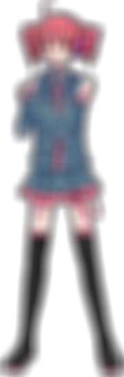

# C++ Image Blurrer

## Purpose
To blur images using two methods:
- **Box Blur**: Older, more traditional and simpler method of blurring. Uses less computational resources for the tradeoff of looking jaggier and sharper at the edges of sampling points.
- **Gaussian Blur**: More modern method, cleaner, but more computationally expensive. Uses a matrix composed of 2 dimensions of sampling from Gaussian distributions, with the midpoint being the target pixel.

## Examples
Box Blur used on the 2008 sprite of Kasane Teto



Gaussian Blur used on the 2008 sprite of Kasane Teto


Gaussian Blur used on an 8K (7680 x 4320) wallpaper. Took about 5 minutes!


## Methods
The box blur method has two modes: CPU and GPU.
- The CPU mode serially performs the calculations by using the passed radius (default being 3) to determine the size of the blur. The higher the radius, the blurrier the image. Pixels in a square around the target pixel are used, and the average value is used to determine the final color of the pixel. This accounts for any number of channels (monochrome, RGB, and RGBA).
- The GPU mode does the same exact thing, except way faster because of multithreading. The default block/thread size in the program is 512 x 512. Due to the parallel nature of GPU mode, it is enabled by default when using box blur.

Gaussian blur only uses the GPU. Here is how it works:
1. The standard deviation is passed into the function, where it is used in the `sample_gaussian()` function to create the Gaussian matrix that is used to sample pixels in the final image.
2. The standard deviation is also used to determine the size of the matrix. A boundary is set at the `3 * std_dev` radius, because any elements past that point are not worth considering in the weighted sum.
3. The image is split into chunks of size 512 x 512 for each kernel call to operate and finish. In a sense, this is still sequential, but it's being done much faster due to ecah individual chunk having parallelized operations.
4. In each chunk, the kernel samples the Gaussian matrix and maps its values to the target pixel's surrounding pixels according to the position in the Gaussian matrix.
5. The final weighted sum is calculated and mapped onto the final image's source data.
6. Once this process is repeated for every pixel, the image is complete and is written to the output.

## Usage
First, you must have CUDA and CMake to use this program.

1. Run the commands `mkdir build` and `cd build` in the root directory.
2. Run `cmake ..` in the `build` directory to build the CMake directory.
3. Run `cmake --build .` to build the executable inside the `build` directory.
4. To run the program, use the command: 

   ```.\Debug\blur.exe <image-path>```

5. You can also use several command line options:
	1. `-c` : use CPU for rendering (slower)
	2. `-r` : choose blur radius for box blur (int, default 3)
	3. `-t` : enable timing
	4. `-g` : use gaussian blur (requires CUDA)
	5. `-s` : specify standard deviation for gaussian blur (double, default 1.0)

## References

- The Wikipedia page for Gaussian blur: https://en.wikipedia.org/wiki/Box_blur
- The Wikipedia page for Gaussian blur: https://en.wikipedia.org/wiki/Gaussian_blur
- OpenGL implementation of Gaussian blur in a game rendering context: https://web.archive.org/web/20150320024135/http://www.gamerendering.com/2008/10/11/gaussian-blur-filter-shader/
